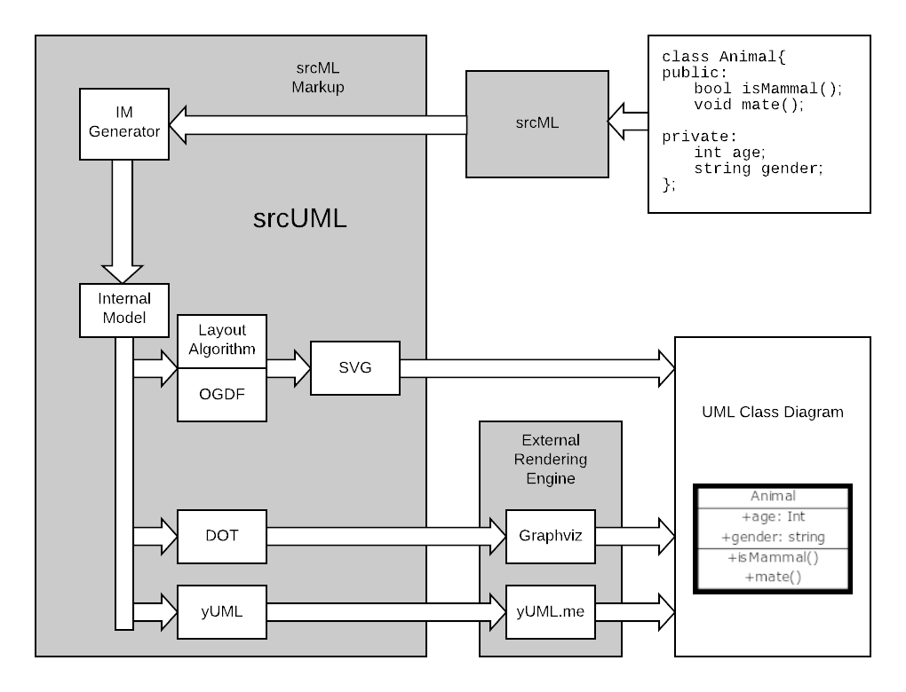

# srcUML #
* A tool for efficiently reverse engineering accurate UML class diagrams.
* More information can be read in the thesis [here](https://etd.ohiolink.edu/pg_10?0::NO:10:P10_ACCESSION_NUM:ksuhonors157557386946271).
* GitHub [Link](https://github.com/srcML/srcUML)
* OGDF [Link](https://ogdf.uos.de/)

### Cloning ###
* The project uses srcSAX and srcSAXEventDispatch as submodules.  The repo most be cloned with the `--recursive` option to clone the submodules.  The following is an example command:
```bash
git clone --recursive https://github.com/srcML/srcUML.git
```

### Build and Install ###
* See [BUILD.md](https://github.com/srcML/srcUML/blob/develop/BUILD.md)

### Status ###
* Highlights the current state of the program, including known bugs, potential future work, and library idiosyncrasies.

### Program Flow ###
* The full process from source code to UML diagram is detailed below.

* Commands for a simple test

### Creating a New Layout ###
* Creating a new layout for srcUML starts by creating a new class that inherits svg_outputter. The example below shows a standard template for a new layout.
```cpp
class svg_xyz_outputter : public svg_outputter {
    svg_xyz_outputter(bool method, bool attr) {
        show_methods = method;
        show_attributes = attr;
    }

    bool output(…) {
        init_standard(classes);

        //code for the new layout using OGDF methods
        //goes here.
	
	}
}
```
* In this case 'xyz' would represent the name of said layout algorithm. Notice that the layout is still based in an SVG output format. This is a coupling issue that could be a basis for future work.
* Construtor Parameters - These represent the ability to turn attributes and methods on and off in the final diagram. They are ***NOT IMPLEMENTED***. Some beginning code exists in svg_printer.
* ***IMPORTANT*** The key here is that the output function should do all the layout, classification, organization that you want. The output function has access to all the protected members of the svg_outputter class. These protected members provide access to the nodes and edges of the graph which can then be manipulated to create the desired layout. How the layout is created is up to the designer.

#### Protected Members from svg_outputter ####
* The first four members listed above represent the OGDF objects that contain all the information about the actual graph, including the nodes and edges. More info can be found
by following the links.
	* [Graph g](https://ogdf.uos.de/doc/classogdf_1_1_graph.html)
	* [GraphAttributes ga](https://ogdf.uos.de/doc/classogdf_1_1_graph_attributes.html)
	* [ClusterGraph cg](https://ogdf.uos.de/doc/classogdf_1_1_cluster_graph.html)
	* [ClusterGraphAttributes cga](https://ogdf.uos.de/doc/classogdf_1_1_cluster_graph_attributes.html)

* The last four objects are maps for convience.
	* std::map< std::shared_ptr< srcuml_class >, node >           class_node_map
	* std::map< std::string, node >                               class_name_node_map
	* std::multimap< std::pair< node, node >, relationship_type > edge_type_map
	* std::map< std::pair< node, edge >, std::string >            node_edge_arrow 

#### Printing to SVG ####
* At the end of the output method, the below lines must be included.
```cpp
GraphIO::SVGSettings* svg_settings = new ogdf::GraphIO::SVGSettings();
		
if(!drawSVG(cga, out, *svg_settings, node_edge_arrow)){
	std::cout << "Error Write" << std::endl;
}

```
* The first line creates a settings object for the actuall svg printing mechanism. It allows for the setting of font size, family and color, as well as other parameters involving the whole of the diagram.
* The if statement is then the actual print call. In this example it takes the cga which is the ClusterGraphAttributes object, however, if one is not dealing with clusters in their layout, you can provide ga, the GraphAttributes object. out is the output stream to write the svg to, the settings are next and finally a node edge arrow object. This object describes the type of arrow to print between any node edge pair. This is important as UML depends on the arrow heads to help identify relationship types.
* svg_printer - This is a modified copy of the svg_printer from OGDF. This is also where the drawSVG function comes from in the if statement above. It would be good to read through the functions quick as it represents the conversion from the UML model to the SVG format.

### Known Bugs ###
* A Segmentation Fault in the svg_three when there are no stereotypes set in the XML.

### Future Work ### 
* Major Future Work would be the decoupling of output type and layout. Right now, if one wants to create a custom layout and use it, it must use the svg_printer.
This is an inconvience if SVG is not the best output type.

### Quirks of OGDF ###
* A description of organization and whatnot

### Final Notes ###
* The current build is dependent on files produced by srcML.


